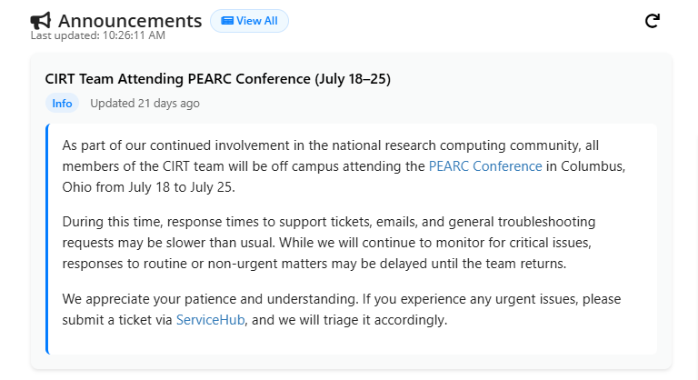

# OnDemand Announcements Widget


A small self-contained widget that fetches and surfaces the latest announcement from a remote HTML page (e.g., a shared "news" page) with basic classification (Info / Maintenance / Alert), age display, and manual refresh. Designed so other sites/locations can drop it in and adapt it for their own announcement feed.

## Features

- Fetches the first announcement from a remote HTML document.
- Parses title, posted date, and body content.
- Classifies announcement type: `Info`, `Maintenance`, or `Alert` based on keywords.
- Displays relative age (e.g., “Updated 5 mins ago”) and last-updated timestamp.
- Manual refresh via button.
- Graceful error handling if the remote content fails to load.
- Easily skinnable via CSS class hooks.

## Installation

1. Clone the repository:
   ```bash
   git clone https://github.com/NessieCanCode/ood_news_widget.git
   cd ood_news_widget
   ```

2. Place or customize the widget file (e.g., `_news.html.erb`) with your announcement source URL and any branding or styling adjustments.
```bash
ln -s _news.html.erb /etc/ood/config/apps/dashboard/views/widgets/_news.html.erb
 ```

## Script Behavior Overview

The embedded script does the following:

1. Fetches the remote announcement HTML page.
2. Parses the document to locate the first `<h2>` (assumed latest announcement) and the next `<h2>` to delimit its body.
3. Extracts a posted date from an `<em>` tag immediately following the first `<h2>` (expects format `MM/DD/YYYY`).
4. Classifies the announcement:
   - `Maintenance` if the title contains “maintenance” or “downtime”
   - `Alert` if it contains “outage” or “fail”
   - Otherwise `Info`
5. Renders:
   - Title as a link placeholder
   - Badge showing type
   - Relative time since posted (e.g., “Updated 2 hours ago”)
   - Body content with the date paragraph stripped
6. Updates a “Last updated” timestamp.
7. Enables manual refresh via a button.

## Configuration

- **Source URL**: Change the fetch target in the script to point to your own announcement page:
  ```js
  const response = await fetch('https://your-org.github.io/your_docs/path_to_news');
  ```

Example: https://ucm-it.github.io/hpc_docs/docs/hpcdocs/HPC-clusters/hpc_news

- **Classification Keywords**: Adjust or extend the keyword logic for your terminology.
- **Styling Hooks**: Customize via CSS targeting:
  - `.announcement-badge.info`, `.announcement-badge.maintenance`, `.announcement-badge.alert`
  - `.announcement-body.info`, etc.
  - `.announcement-container`, `.announcement-topic`, `.announcement-meta`, `.last-updated`

## Below are the actual rules the widget uses by default; you can override any of these—for example:

```css
/* Container / header / actions */
.widget-header {
  display: flex;
  justify-content: space-between;
  align-items: center;
  font-size: 1.25rem;
  font-weight: 600;
  color: #222;
}
.widget-title {
  display: flex;
  align-items: center;
  gap: 0.5rem;
}
.widget-action {
  font-size: 1rem;
  padding: 0.2rem 0.8rem;
  border: none;
  background: white;
  border-radius: 999px;
  cursor: pointer;
  display: flex;
  align-items: center;
  gap: 0.4rem;
}

/* “View All” link/button */
.announcement-viewall {
  font-size: 0.75rem;
  background: #f0f9ff;
  border: 1px solid #cce5ff;
  color: #007bff;
  padding: 0.2rem 0.75rem;
  border-radius: 999px;
  cursor: pointer;
}

/* Timestamp */
.last-updated {
  font-size: 0.75rem;
  color: #666;
  margin-top: -0.5rem;
}

/* Announcement card */
.announcement-container {
  font-family: system-ui, sans-serif;
  color: #111;
  box-shadow: 0 2px 4px rgba(0, 0, 0, 0.1);
  border-radius: 8px;
  padding: 1rem;
  background: #f9fafa;
  margin-top: 10px;
  margin-bottom: 10px;
}
.announcement-topic {
  font-weight: 600;
  font-size: 1rem;
  color: #111;
  margin-bottom: 0.25rem;
}
.announcement-link {
  color: #000000;
  text-decoration: none;
  font-weight: 600;
  cursor: pointer;
}
.announcement-link:hover {
  text-decoration: underline;
}
.announcement-meta {
  display: flex;
  align-items: center;
  gap: 0.75rem;
  font-size: 0.85rem;
  color: #555;
  margin-bottom: 0.5rem;
}
.announcement-badge {
  padding: 2px 8px;
  font-size: 0.75rem;
  font-weight: 600;
  border-radius: 999px;
  display: inline-block;
}
.announcement-badge.info {
  background-color: #e6f1fd;
  color: #007bff;
}
.announcement-badge.alert {
  background-color: #fdecea;
  color: #d32f2f;
}
.announcement-badge.maintenance {
  background-color: #fff4e5;
  color: #ff9800;
}
.announcement-time {
  font-size: 0.8rem;
  color: #666;
}
.announcement-body {
  margin-top: 0.75rem;
  padding: 0.75rem 1rem;
  border-left: 3px solid #007bff;
  border-radius: 6px;
  font-size: 0.95rem;
  color: #222;
  line-height: 1.5;
  background: #fff;
}
.announcement-body.alert {
  border-left-color: #d32f2f;
}
.announcement-body.maintenance {
  border-left-color: #ff9800;
}
.no-jobs-msg {
  padding: 1rem;
  background: #fff;
  border-radius: 10px;
  font-size: 0.95rem;
  text-align: center;
  color: #555;
}
```

## Deployment

1. Commit the widget (e.g., `_news.html.erb`) into your GitHub repo or deployment source.
2. Publish the announcement source document (with `<h2>` sections) where the widget can reach it (GitHub Pages, internal web server, etc.).
3. Embed the widget snippet on the target dashboard or page.
4. Ensure CORS is configured appropriately if fetching cross-origin — either enable appropriate headers on the announcement host or proxy through a same-origin backend.

## Expected Announcement Document Format

The widget assumes the source HTML has structure like:

```html
<h2>Planned Maintenance</h2>
<p><em>08/01/2025</em></p>
<p>We will be performing scheduled maintenance on the cluster...</p>
<h2>Previous Announcement</h2>
<p>...</p>
```

The first `<h2>` is treated as the latest announcement, with the next `<h2>` marking the end of its content.

## Error Handling

If fetching or parsing fails, the widget displays:

```html
<div class="no-jobs-msg">Unable to load announcements.</div>
```

Check the browser console for detailed error output when debugging.

## Extensibility Ideas

- Support rendering a list of recent announcements instead of only the first.
- Cache fetched HTML locally to reduce load frequency or survive transient failures.
- Replace the placeholder title link with a real permalink to the full announcement.
- Add i18n support for date formatting or alternative locales.
- Expose source URL, classification rules, or thresholds via `data-` attributes or an initialization object instead of hardcoded values.

## Troubleshooting

- **No content shown**: Verify the announcement source contains at least one `<h2>` and that the fetch URL is reachable.
- **CORS blocked**: Inspect network requests; if blocked, adjust headers or route through a proxy.
- **Timestamps not updating**: Confirm the script successfully runs and that `loadFirstNewsItem()` isn’t failing silently.

## Contributing

1. Fork the repository.
2. Make improvements or adapt it to your environment.
3. Submit a pull request including:
   - The announcement source URL you tested against.
   - Any custom keyword/classification logic you added.
   - Optional: Screenshots or examples of it embedded in your dashboard.

## License

Licensed under the MIT License. See the `LICENSE` file for full details.
